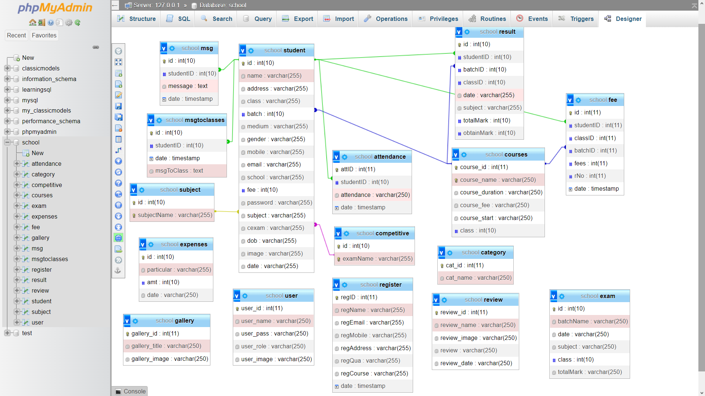

# CSDL-School Management

## Thành viên của nhóm
- Đặng Tuần Long - 23021614 (DLdevcoder)

## Các công nghệ đã sử dụng
- Bootstrap
- Jquery
- PHP
- Xampp

## Database

## Các chức năng của trang web
- Homepage: trang chủ của trang web, đã hoàn thành UI/UX
- Admin page: trang quản lý page của admin, những tài khoản được cấp quyền admin có thể đăng nhập vào section này và thực hiện chỉnh sửa dữ liệu
- Admin page có nhiều section, trong đó một số section đã hoàn thành đầy đủ các chức năng CRUD như: Dashboard, Học sinh, Học phí, Thư viện ảnh. Admin có thể quản lý thêm, sửa, xóa, cập nhật thông tin qua các section này

## Cách cài đặt và kiểm thử
- Trước hết, các bạn cần clone project này về máy, để trong thư mục htdocs của Xampp ( đường dẫn sẽ có dạng ../Xampp/htdocs/tên-project )
_Lưu ý_ Bước này phải làm đúng nếu không sẽ không thể liên kết trang web với cơ sở dữ liệu
- Sau đó các bạn mở Xampp và khởi động Phpmyadmin, tạo một cơ sở dữ liệu mới tên 'school', sau đó copy phần code SQL trong file CreateDatabase.txt vào để add các bảng trong cơ sở dữ liệu
- Để kiểm thử sản phẩm, các bạn vào browser và truy cập địa chỉ http://localhost/tên-project/index.php để vào trang Homepage hoặc địa chỉ http://localhost/tên-project/admin/login.php để vào phần login admin (bạn cũng có thể vào trang login admin bằng nút login trong trang Homepage)
- Tài khoản và mật khẩu admin: niichan
